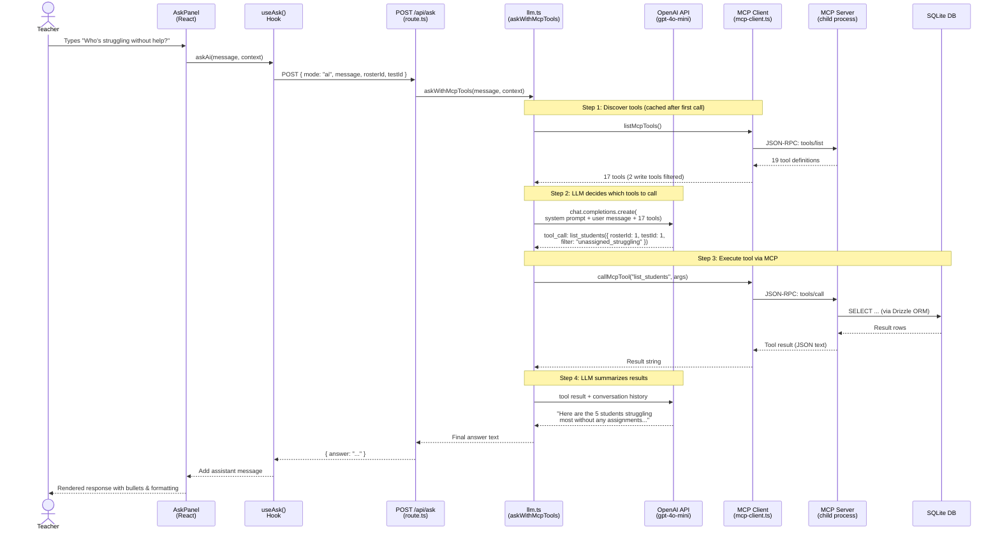
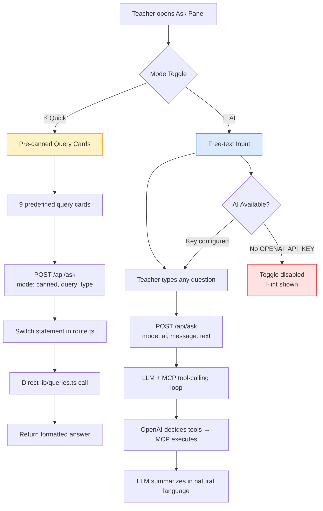

# AI Chatbot Architecture

> How the Natural Language Ask feature integrates the Next.js dashboard with OpenAI and the MCP Server.

---

## High-Level Overview

The AI Chatbot (Phase 11) lets teachers ask free-form questions about their class data. It uses **OpenAI function-calling** to decide which data tools to invoke, and routes those tool calls through the project's own **MCP Server** via a stdio child process.

```
┌─────────────────────────────────────────────────────────────────────┐
│                        BROWSER (React)                              │
│                                                                     │
│  ┌──────────┐    ┌───────────┐    ┌───────────────────────────────┐ │
│  │ AskButton│───▶│ AskPanel  │    │  useAsk() Hook                │ │
│  └──────────┘    │           │◀──▶│  - askCanned() (Quick mode)   │ │
│                  │ ⚡Quick/🤖AI│   │  - askAi()    (AI mode)      │ │
│                  │  toggle   │    │  - aiAvailable (GET /api/ask) │ │
│                  └───────────┘    └──────────┬────────────────────┘ │
│                                              │                      │
│                                    POST /api/ask                    │
│                                    { mode, message, rosterId, ... } │
└──────────────────────────────────────────────┼──────────────────────┘
                                               │
                                               ▼
┌──────────────────────────────────────────────────────────────────────┐
│                     NEXT.JS API ROUTE  (src/app/api/ask/route.ts)   │
│                                                                      │
│   ┌──────────────────────────┐    ┌────────────────────────────────┐ │
│   │  mode === "canned"       │    │  mode === "ai"                 │ │
│   │  ─────────────────       │    │  ────────────                  │ │
│   │  Switch on query type    │    │  Calls askWithMcpTools()       │ │
│   │  → Direct SQL / lib fn   │    │  from src/lib/llm.ts           │ │
│   │  → Return { answer }     │    │                                │ │
│   └──────────────────────────┘    └───────────────┬────────────────┘ │
│                                                   │                  │
└───────────────────────────────────────────────────┼──────────────────┘
                                                    │
                                                    ▼
┌──────────────────────────────────────────────────────────────────────┐
│                     LLM LAYER  (src/lib/llm.ts)                      │
│                                                                      │
│  1. Discover tools ──▶ listMcpTools()                                │
│  2. Convert MCP schemas ──▶ OpenAI function-calling format           │
│  3. Build system prompt (domain context, roster/test info)           │
│  4. Call OpenAI chat.completions.create()                            │
│  5. If tool_calls returned ──▶ callMcpTool(name, args) ──▶ loop     │
│  6. Return final text answer                                         │
│                                                                      │
│  ┌────────────────────┐       ┌───────────────────────────────────┐  │
│  │ Tool-calling loop  │       │  Safety: write tools blocked      │  │
│  │ (max 5 rounds)     │       │  (create_assignment,              │  │
│  │                    │       │   delete_assignment)               │  │
│  └────────┬───────────┘       └───────────────────────────────────┘  │
│           │                                                          │
└───────────┼──────────────────────────────────────────────────────────┘
            │
    ┌───────┴────────┐
    │                │
    ▼                ▼
┌────────┐   ┌──────────────────────────────────────────────────────────┐
│ OpenAI │   │           MCP CLIENT  (src/lib/mcp-client.ts)            │
│  API   │   │                                                          │
│        │   │  Singleton wrapper around @modelcontextprotocol/sdk      │
│ gpt-4o │   │  ─────────────────────────────────────────────────       │
│  -mini │   │  • ensureConnected() — lazy init, spawns child process   │
│        │   │  • listMcpTools()    — discover 19 tools via MCP         │
│        │   │  • callMcpTool()     — execute tool via JSON-RPC         │
│        │   │  • disconnectMcpClient() — cleanup on exit               │
│        │   │                                                          │
└────────┘   └──────────────────────────┬───────────────────────────────┘
                                        │
                              StdioClientTransport
                             (JSON-RPC over stdin/stdout)
                              npx tsx src/mcp/server.ts
                                        │
                                        ▼
┌──────────────────────────────────────────────────────────────────────┐
│                MCP SERVER  (src/mcp/server.ts)                       │
│                Child process — stdio transport                       │
│                                                                      │
│  ┌────────────────┐ ┌──────────────────┐ ┌────────────────────────┐  │
│  │ roster-tools   │ │ performance-tools│ │ assignment-tools       │  │
│  │ (3 tools)      │ │ (5 tools)        │ │ (4 tools)             │  │
│  │ ─────────────  │ │ ────────────────  │ │ ──────────────────    │  │
│  │ list_rosters   │ │ get_performance_ │ │ list_assignments      │  │
│  │ list_students  │ │  distribution    │ │ get_student_           │  │
│  │ get_student_   │ │ get_rc_breakdown │ │  assignments          │  │
│  │  detail        │ │ get_performance_ │ │ create_assignment ✗   │  │
│  │                │ │  levels          │ │ delete_assignment ✗   │  │
│  │                │ │ list_test_groups │ │                       │  │
│  │                │ │ list_tests       │ │                       │  │
│  └────────────────┘ └──────────────────┘ └────────────────────────┘  │
│                                                                      │
│  ┌────────────────┐ ┌──────────────────┐ ┌────────────────────────┐  │
│  │ impact-tools   │ │ standards-tools  │ │ analytics-tools        │  │
│  │ (3 tools)      │ │ (3 tools)        │ │ (1 tool)              │  │
│  │ ─────────────  │ │ ────────────────  │ │ ──────────────────    │  │
│  │ get_assignment_│ │ get_standards_   │ │ query_students_       │  │
│  │  impact        │ │  breakdown       │ │  natural              │  │
│  │ get_all_impacts│ │ get_students_by_ │ │                       │  │
│  │ get_standard_  │ │  standard        │ │                       │  │
│  │  level_impact  │ │ list_reporting_  │ │                       │  │
│  │                │ │  categories      │ │                       │  │
│  └────────────────┘ └──────────────────┘ └────────────────────────┘  │
│                                                                      │
│                ✗ = blocked by read-only filter in llm.ts             │
│                                                                      │
│  All tools call functions from:                                      │
│  • src/lib/queries.ts  (Drizzle ORM queries)                         │
│  • src/lib/impact.ts   (DiD calculations)                            │
│  • Direct SQLite via better-sqlite3                                  │
│                                                                      │
└──────────────────────────┬───────────────────────────────────────────┘
                           │
                           ▼
                  ┌─────────────────┐
                  │   SQLite DB     │
                  │ data/teacher-   │
                  │  dashboard.db   │
                  │                 │
                  │ 13 tables:      │
                  │ rosters,        │
                  │ students,       │
                  │ scores,         │
                  │ assignments,    │
                  │ standards, ...  │
                  └─────────────────┘
```

---

## Sequence Diagram — AI Mode Request



---

## How OpenAI Discovers MCP Tools

OpenAI has **no native awareness of MCP**. The LLM layer (`src/lib/llm.ts`) acts as a translation bridge between the two protocols:

### 1. Tool Discovery via MCP Client

On the first AI request, `getToolDefinitions()` calls `listMcpTools()`, which sends a JSON-RPC `tools/list` request to the MCP Server child process. The server returns all 19 tool definitions, each with a name, description, and a **JSON Schema** describing its input parameters (originally defined via Zod in the MCP tool files).

### 2. Schema Conversion — MCP → OpenAI Format

The `mcpToolToOpenAI()` function reshapes each MCP tool into OpenAI's `ChatCompletionTool` format. Since MCP already uses JSON Schema internally, the mapping is nearly 1:1:

```typescript
// src/lib/llm.ts — mcpToolToOpenAI()
function mcpToolToOpenAI(tool: McpToolDef): OpenAI.Chat.Completions.ChatCompletionTool {
  return {
    type: "function",
    function: {
      name: tool.name,              // e.g. "list_students"
      description: tool.description, // e.g. "List students in a roster with scores..."
      parameters: tool.inputSchema,  // JSON Schema from MCP (auto-converted from Zod)
    },
  };
}
```

### 3. Filtering & Caching

Before sending to OpenAI, the tool list is filtered (removing 2 write tools: `create_assignment`, `delete_assignment`) and cached in-memory for subsequent requests. This means tool discovery only happens once per server lifecycle.

### 4. Sent with Every LLM Request

The converted tool array (17 read-only tools) is passed in the `tools` parameter of `openai.chat.completions.create()`. OpenAI sees them as standard function-calling definitions — it has no idea they originate from MCP.

### 5. Reverse Translation — Tool Calls Back to MCP

When OpenAI responds with a `tool_call` (e.g., `list_students({ rosterId: 1, testId: 1 })`), the code parses the function name and arguments, then routes the call back through `callMcpTool(name, args)`, which sends a JSON-RPC `tools/call` to the MCP Server. The result is fed back into the conversation for the next LLM round.

```
MCP Server                    llm.ts                         OpenAI API
    │                            │                               │
    │◀── tools/list ─────────────│                               │
    │── 19 tool defs (JSON) ────▶│                               │
    │                            │── filter to 17 read-only ──▶  │
    │                            │── convert to OpenAI format ──▶│
    │                            │                               │
    │                            │   chat.completions.create()   │
    │                            │   { tools: [...17 tools] }  ─▶│
    │                            │                               │
    │                            │◀── tool_call: list_students() │
    │◀── tools/call ─────────────│                               │
    │── result JSON ────────────▶│                               │
    │                            │── tool result ───────────────▶│
    │                            │◀── final text answer ─────────│
```

> **Key insight**: OpenAI never "knows about" MCP. The `llm.ts` module is the bridge — it speaks MCP on one side (JSON-RPC over stdio) and OpenAI function-calling on the other (HTTPS REST). Adding a new MCP tool automatically makes it available to the AI chatbot with zero glue code changes.

---

## Dual-Mode Design

The Ask panel supports two modes, toggled via a UI switch:



---

## Component Map

| Layer | File | Responsibility |
|-------|------|---------------|
| **UI** | `src/components/AskButton.tsx` | Floating button to open the Ask panel |
| **UI** | `src/components/AskPanel.tsx` | Sheet panel with Quick/AI toggle, text input, chat messages, query cards |
| **UI** | `src/components/ui/switch.tsx` | Radix Switch primitive for mode toggle |
| **UI** | `src/components/ui/textarea.tsx` | Text area for AI free-text input |
| **Hook** | `src/hooks/useAsk.ts` | `askCanned()`, `askAi()`, `aiAvailable` check, chat state management |
| **API** | `src/app/api/ask/route.ts` | GET: AI availability check; POST: dual-mode handler (canned vs AI) |
| **LLM** | `src/lib/llm.ts` | OpenAI client singleton, system prompt builder, tool-calling loop (max 5 rounds), read-only filter |
| **MCP Client** | `src/lib/mcp-client.ts` | Singleton MCP client, stdio transport, child process lifecycle, `listMcpTools()`, `callMcpTool()` |
| **MCP Server** | `src/mcp/server.ts` | McpServer with stdio transport, registers 6 tool groups (19 tools total) |
| **Tools** | `src/mcp/tools/*.ts` | 6 tool files: roster, performance, assignment, impact, standards, analytics |
| **Data** | `src/lib/queries.ts` | Drizzle ORM query functions (shared by API routes and MCP tools) |
| **Data** | `src/lib/impact.ts` | Difference-in-Differences statistical calculations |
| **DB** | `data/teacher-dashboard.db` | SQLite database (13 tables, accessed via better-sqlite3) |

---

## Configuration

| Variable | File | Purpose |
|----------|------|---------|
| `OPENAI_API_KEY` | `.env.local` | OpenAI API authentication |
| `OPENAI_MODEL` | `.env.local` | Model selection (default: `gpt-4o-mini`) |

When `OPENAI_API_KEY` is missing or set to the placeholder value `sk-your-key-here`:
- `GET /api/ask` returns `{ aiAvailable: false }`
- The AI toggle in the UI is disabled with a hint message
- `POST /api/ask` with `mode: "ai"` returns `503 Service Unavailable`
- Quick mode (pre-canned queries) continues to work normally

---

## Safety & Guardrails

| Guardrail | Implementation |
|-----------|---------------|
| **Read-only enforcement** | `llm.ts` filters out `create_assignment` and `delete_assignment` from tool list; runtime check blocks them even if LLM hallucinates a call |
| **Tool round limit** | Max 5 LLM ↔ tool rounds per request to prevent infinite loops |
| **Token limit** | `max_tokens: 2000` on OpenAI responses |
| **API key server-side only** | Key never sent to browser; all LLM calls in API route |
| **Error surfacing** | Route catches OpenAI errors (429 quota, 401 invalid key, model not found) and returns specific user-facing messages |
| **Graceful degradation** | If AI unavailable, UI falls back to Quick mode; toggle is disabled |

---

## Data Flow Summary

```
Teacher Question
       │
       ▼
   AskPanel (React)
       │
   useAsk() hook ── POST /api/ask ──┐
                                     │
                            ┌────────┴────────┐
                            │                 │
                      mode: canned       mode: ai
                            │                 │
                     switch(query)     askWithMcpTools()
                            │                 │
                     lib/queries.ts    ┌──────┴──────┐
                            │         │             │
                            │    OpenAI API    MCP Client
                            │    (function     (stdio transport)
                            │     calling)          │
                            │         │        MCP Server
                            │         │        (child process)
                            │         │             │
                            │         │      lib/queries.ts
                            │         │      lib/impact.ts
                            │         │             │
                            ▼         ▼             ▼
                         ┌─────────────────────────────┐
                         │     SQLite Database          │
                         │   data/teacher-dashboard.db  │
                         └─────────────────────────────┘
```
